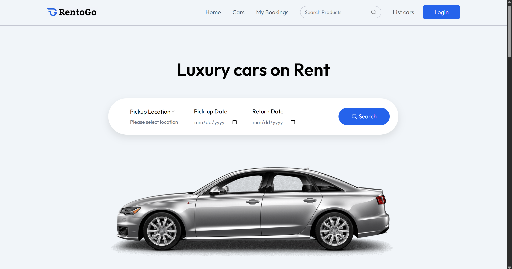
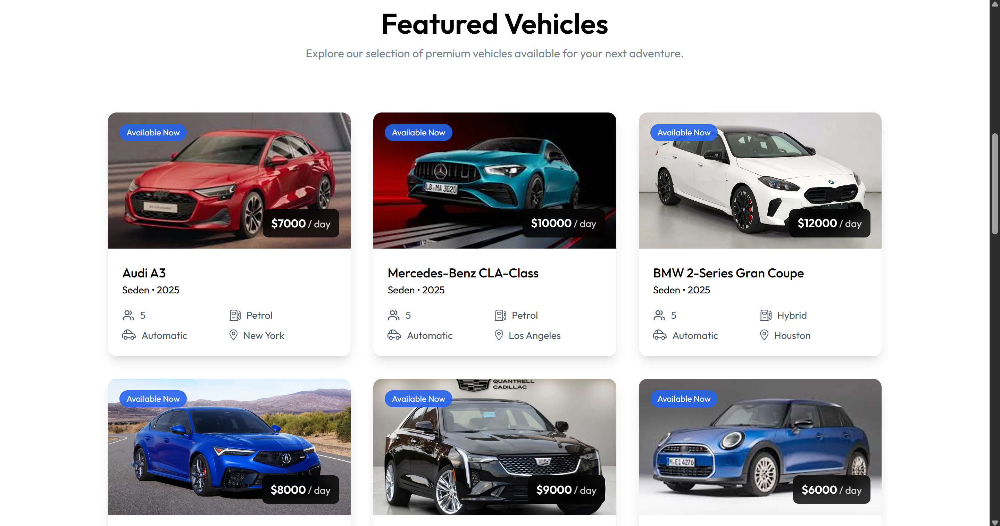
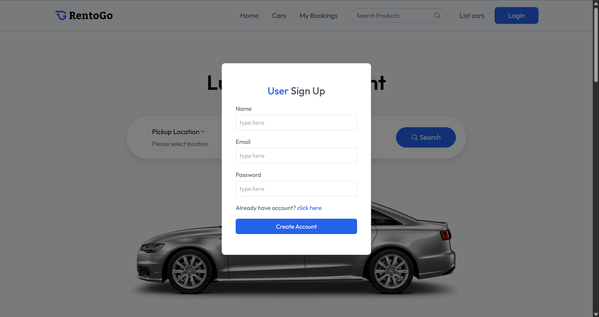
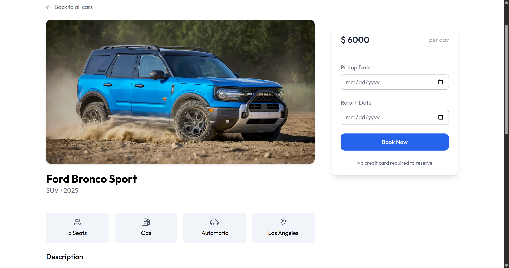
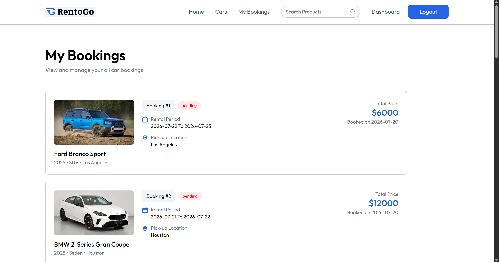
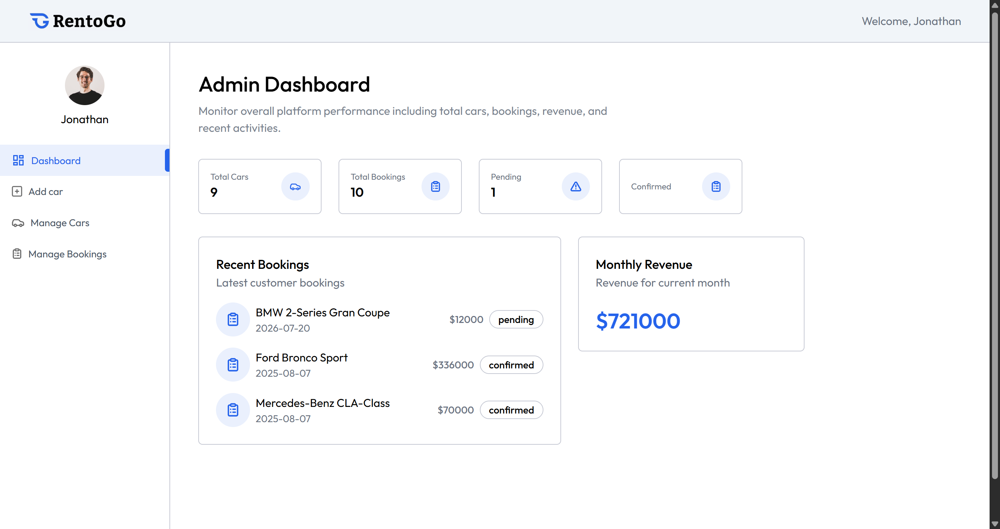
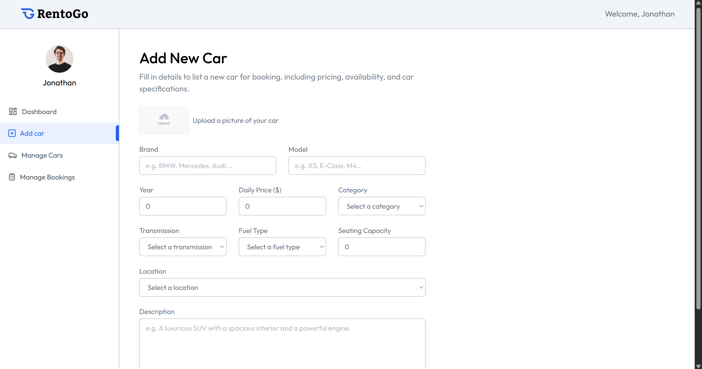
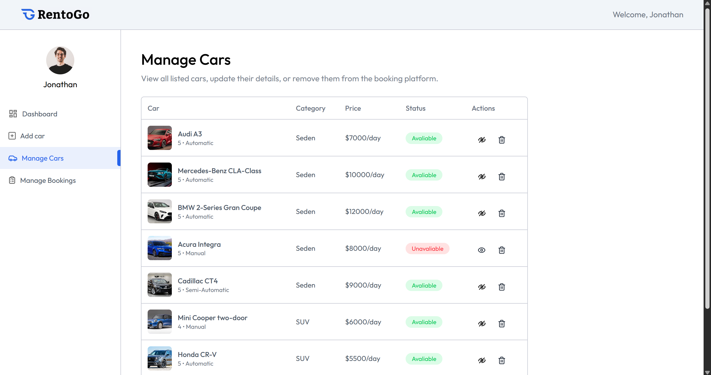
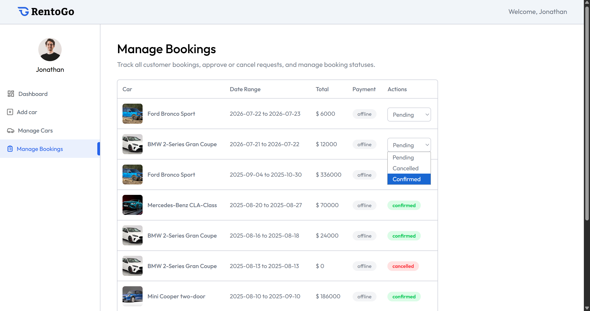
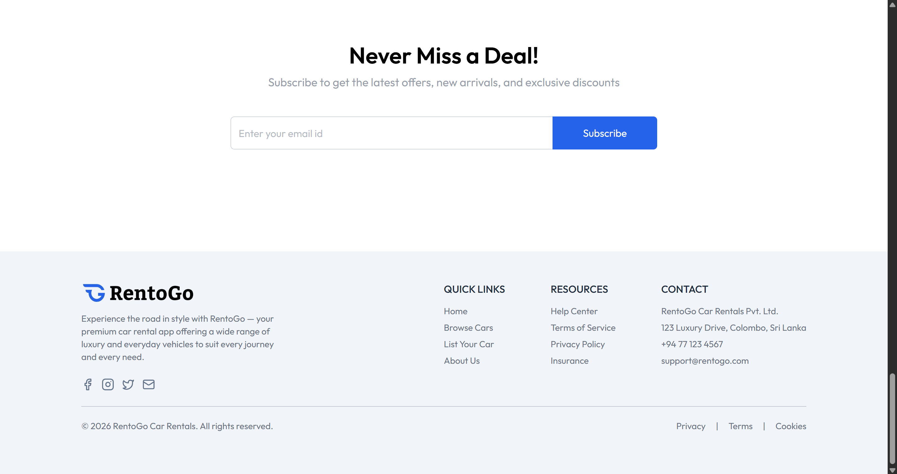

# 🚗 RentoGo - Car Rental Booking Application

A full-stack car rental booking application built with the MERN stack, allowing users to explore available vehicles, select rental dates, book cars, and manage their reservations, while providing owner dashboards for managing cars and bookings.

## 🔍 Overview

RentoGo is a complete car rental platform that connects vehicle owners and customers through a seamless booking experience.

Users can create accounts, browse featured vehicles, view car details, select rental dates, and make bookings. Vehicle owners have dedicated dashboards to manage their cars, update availability status, and handle customer bookings.

The system includes separate owner dashboards, allowing each owner to manage their own vehicle inventory and booking activities independently.

## 🛠️ Tech Stack

- ⚛️ React.js
- 🎨 Tailwind CSS
- 🟢 Node.js
- 🚂 Express.js
- 🍃 MongoDB
- 🔐 JWT Authentication
- 🖼️ ImageKit

## ✨ Features

### 👤 User Features

- User registration and authentication
- Browse available vehicles
- View featured cars
- Select rental dates
- Book cars online
- View booking history
- Track booking status updates

### 🚘 Owner/Admin Features

- Separate owner dashboard
- Add new vehicles
- Manage car inventory
- Update car availability status
- Edit and delete car details
- Manage customer bookings
- Update booking status
- Owner-specific data management

### ⚡ Additional Features

- Secure authentication using JWT
- Image upload and optimization using ImageKit
- Real-time booking status updates
- CRUD operations for vehicle management
- Responsive user interface

## 📸 Screenshots

### 🏠 Home Page

### 🚘 Featured Vehicles

### 👤 User Signup

### 📅 Book Now

### 📋 My Bookings

### 👨‍💼 Owner Dashboard

### ➕ Add New Car

### 🚗 Manage Cars

### 📑 Manage Bookings

### 🔻 Footer

